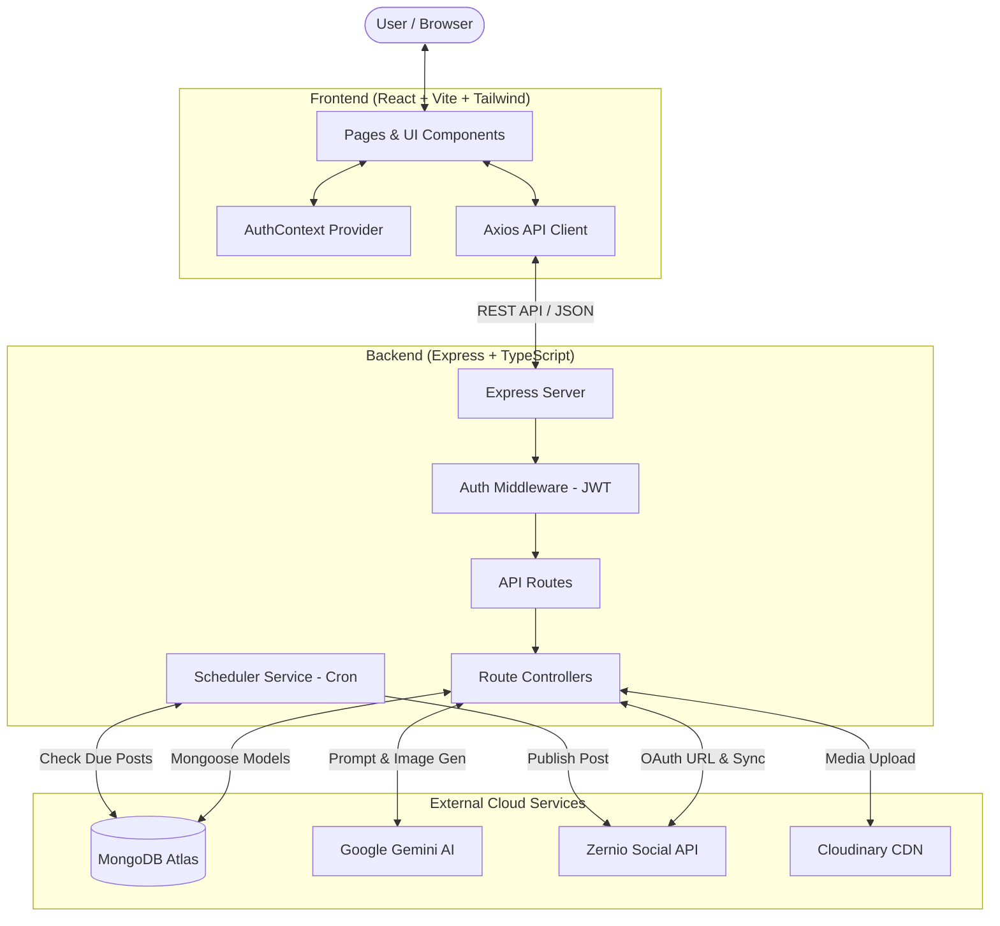
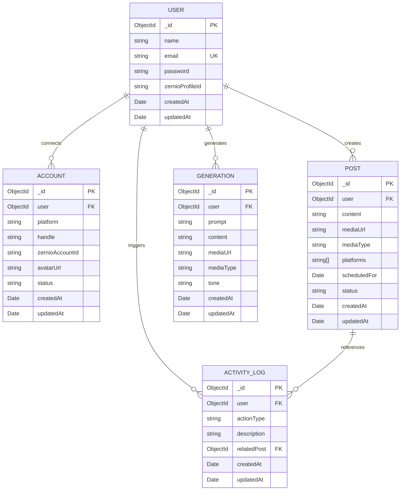

# Postly AI - Social Media Management & AI Post Automation Platform

<p align="center">
  
</p>

<p align="center">
  <b>An end-to-end, enterprise-ready social media automation and AI-driven content generation suite.</b>
</p>

<p align="center">
  
  
  
  
  
  
</p>

---

## 📑 Table of Contents

1. [Overview](#-overview)
2. [Key Features](#-key-features)
3. [System Architecture](#-system-architecture)
4. [Frontend Architecture & Folder Structure](#-frontend-architecture--folder-structure)
   - [File Tree](#frontend-file-tree)
   - [Frontend Data Flow](#frontend-data-flow)
5. [Backend Architecture & Folder Structure](#-backend-architecture--folder-structure)
   - [File Tree](#backend-file-tree)
   - [Backend Data Flow](#backend-data-flow)
6. [Complete API Documentation](#-complete-api-documentation)
   - [Authentication Endpoints](#1-authentication-endpoints-apiauth)
   - [Social OAuth & Sync Endpoints](#2-social-oauth--sync-endpoints-apioauth)
   - [Connected Accounts Endpoints](#3-connected-accounts-endpoints-apiaccounts)
   - [Posts & AI Generation Endpoints](#4-posts--ai-generation-endpoints-apiposts)
   - [Activity Logs Endpoints](#5-activity-logs-endpoints-apiactivity)
   - [System Health Endpoint](#6-system-health-endpoint-)
7. [Environment Variables](#-environment-variables)
8. [Installation & Local Setup](#-installation--local-setup)
9. [Database Schema Design](#-database-schema-design)
10. [Background Job Scheduler](#-background-job-scheduler)

---

## 🚀 Overview

**Postly AI** is a modern SaaS platform designed to streamline social media creation, scheduling, and multi-network publishing. By integrating **Google Gemini** for multimodal text/image prompt engineering and **Zernio** for multi-account social network connectivity (Twitter/X, LinkedIn, Facebook, Instagram), Postly AI empowers users to manage their entire social presence from a single dashboard.

---

## ✨ Key Features

- **Multimodal AI Content Generation**: Generate high-converting social media posts and accompanying visual prompts using Google Gemini (`gemini-2.5-flash`) and Imagen (`imagen-3.0-generate-002`).
- **One-Click Multi-Platform Publishing**: Simultaneously publish or schedule posts to Twitter/X, LinkedIn, Facebook, and Instagram.
- **Automated Background Scheduler**: Built-in cron scheduler (`node-cron`) automatically queries and dispatches due posts every minute through Zernio API.
- **Social Account Linking via OAuth**: Seamless connection and synchronization of social profiles via Zernio Connect.
- **Media Asset Pipeline**: Instant media upload and optimization via Cloudinary for images and videos.
- **Analytics & Activity Tracking**: Real-time activity logs and metrics displaying scheduled, published, and drafted posts.
- **Role & Route Protection**: Full JWT authentication with persistent user sessions and client-side route guards.

---

## 🏗 System Architecture



---

## 🎨 Frontend Architecture & Folder Structure

The frontend is built with **React 19**, **Vite**, **TypeScript**, and **Tailwind CSS**. It uses **Lucide React** for icons, **Axios** for API calls, and **React Router v7** for single-page routing.

### Frontend File Tree

```
frontend/
├── public/
│   ├── favicon.svg             # Postly AI browser favicon
│   ├── icons.svg               # SVG icons sheet
│   └── logo.svg                # Main application brand logo
├── src/
│   ├── assets/
│   │   ├── assets.tsx          # Reusable SVG assets and brand badges
│   │   ├── img-1.jpg           # Static dashboard demo asset 1
│   │   ├── img-2.jpg           # Static dashboard demo asset 2
│   │   ├── img-3.jpg           # Static dashboard demo asset 3
│   │   └── img-4.jpg           # Static dashboard demo asset 4
│   ├── components/
│   │   ├── Home/               # Public Landing Page Sections
│   │   │   ├── CTA.tsx         # Call to action banner
│   │   │   ├── Features.tsx    # Feature highlights grid
│   │   │   ├── Footer.tsx      # Landing page footer
│   │   │   ├── Hero.tsx        # Hero banner with primary CTA
│   │   │   ├── HowItWorks.tsx  # Step-by-step workflow guide
│   │   │   ├── Navbar.tsx      # Landing page top navigation
│   │   │   ├── Pricing.tsx     # Tiered pricing plans table
│   │   │   └── Testimonials.tsx# User reviews and social proof
│   │   ├── AccountList.tsx     # Grid of connected social accounts
│   │   ├── Layout.tsx          # Shell layout (Sidebar + Header + Content)
│   │   ├── NoAccountsConnected.tsx # Empty state placeholder for accounts
│   │   ├── PlatformPickerModal.tsx # Modal to select and connect social channels
│   │   ├── ProtectedRoute.tsx  # Route guard redirecting unauthenticated users
│   │   └── Sidebar.tsx         # Navigational sidebar with active state & logout
│   ├── context/
│   │   └── AuthContext.tsx     # Global auth state (User, Token, Login, Logout)
│   ├── pages/
│   │   ├── Accounts.tsx        # Social accounts management & OAuth sync
│   │   ├── AIComposer.tsx      # Gemini AI prompt creator & post generator
│   │   ├── Dashboard.tsx       # Main analytics, stats, recent posts, activity
│   │   ├── Home.tsx            # Public marketing landing page
│   │   ├── Login.tsx           # Dual Login / Registration authentication page
│   │   └── Scheduler.tsx       # Post calendar, manual composer & scheduling
│   ├── services/
│   │   └── api.ts              # Typed Axios client with JWT interceptor & API methods
│   ├── App.tsx                 # Root router configuration & route hierarchy
│   ├── index.css               # Global Tailwind CSS directives & custom utilities
│   └── main.tsx                # React DOM entry point
├── eslint.config.js            # ESLint rules configuration
├── index.html                  # HTML entry template
├── package.json                # Frontend dependencies & build scripts
├── tsconfig.app.json           # Client TypeScript configuration
├── tsconfig.json               # Root TypeScript configuration
├── tsconfig.node.json          # Node/Vite TypeScript configuration
└── vite.config.ts              # Vite config with proxy to backend port 3000
```

### Frontend Data Flow

1. **Authentication Flow**:
   - User inputs credentials on `Login.tsx`.
   - `api.login()` or `api.register()` calls `POST /api/auth/login` or `POST /api/auth/register`.
   - The received JWT token and user profile are persisted in `localStorage` through `AuthContext.tsx`.
   - `ProtectedRoute.tsx` grants access to dashboard routes (`/dashboard`, `/accounts`, `/schedule`, `/ai-composer`).

2. **API Request Flow**:
   - Every outgoing request in `services/api.ts` attaches `Authorization: Bearer <token>` via Axios interceptors.
   - If an API returns `401 Unauthorized`, the interceptor clears credentials and redirects the user to `/login`.

3. **Social Account Linking Flow**:
   - User clicks **"Connect Account"** in `Accounts.tsx` or `PlatformPickerModal.tsx`.
   - Frontend calls `GET /api/oauth/:platform/url` to fetch the Zernio OAuth URL.
   - User is redirected to the provider's OAuth page and redirected back to `/accounts?connected=:platform`.
   - On redirect load, `Accounts.tsx` calls `GET /api/oauth/sync` to pull and save connected accounts.

4. **AI Generation & Scheduling Flow**:
   - In `AIComposer.tsx`, the user enters a topic and tone.
   - `api.generatePost()` calls `POST /api/posts/generate`. The response returns structured post text and an Imagen-generated image URL.
   - User clicks **"Schedule Post"**, which forwards the content, media, and selected platforms to `Scheduler.tsx` or directly schedules via `api.createPost()`.

---

## ⚙️ Backend Architecture & Folder Structure

The backend is built with **Node.js**, **Express**, **TypeScript**, **Mongoose (MongoDB)**, **@google/genai**, **@zernio/node**, and **Cloudinary**.

### Backend File Tree

```
backend/
├── config/
│   ├── cloudinaryConfig.ts     # Cloudinary SDK init & base64/file upload handler
│   ├── dbConnection.ts         # Mongoose connection with reconnection event handlers
│   ├── multerConfig.ts         # Multer configuration for multipart media uploads
│   ├── vConfig.ts              # Environment port and runtime configurations
│   └── zernioConfig.ts         # Zernio API client initialization
├── controllers/
│   ├── accountControllers.ts   # List accounts, manual account creation, delete account
│   ├── activityController.ts   # Fetch recent user activity logs with post references
│   ├── authController.ts       # User registration, password hashing & login with JWT
│   ├── postController.ts       # AI post generation, list posts, schedule & delete posts
│   └── socialAuthController.ts # Zernio profile resolution, OAuth URL & account sync
├── interfaces/
│   └── AuthRequest.ts          # Express Request interface extension containing user payload
├── middlewares/
│   └── authMiddleware.ts       # Bearer JWT verification & user attachment middleware
├── models/
│   ├── Account.ts              # Mongoose schema for connected social channels
│   ├── ActivityLog.ts          # Mongoose schema for audit trail of user actions
│   ├── Generation.ts           # Mongoose schema for AI generation history
│   ├── Post.ts                 # Mongoose schema for scheduled & published posts
│   └── User.ts                 # Mongoose schema for user accounts & Zernio profile ID
├── routes/
│   ├── accountRoutes.ts        # Routes for /api/accounts
│   ├── activityRoutes.ts       # Routes for /api/activity
│   ├── authRoutes.ts           # Routes for /api/auth
│   ├── postRoutes.ts           # Routes for /api/posts
│   └── socialAuthRoutes.ts     # Routes for /api/oauth
├── services/
│   └── schedulerService.ts     # node-cron worker polling and publishing due posts
├── .env                        # Private environment variables (API keys & Secrets)
├── package.json                # Backend dependencies and scripts
├── server.ts                   # Express server initialization, middleware & routes
└── tsconfig.json               # Backend TypeScript configuration
```

### Backend Data Flow

1. **Incoming Request Processing**:
   - `server.ts` parses incoming JSON and URL-encoded bodies via `express.json()` and `cors()`.
   - Routes check authentication using `protectRoute` middleware (`middlewares/authMiddleware.ts`), which extracts and verifies the JWT token from the `Authorization` header and populates `req.user`.

2. **Controller & Service Layer**:
   - Controllers interact with **MongoDB** via Mongoose models (`User`, `Account`, `Post`, `Generation`, `ActivityLog`).
   - For AI workflows, `postController.ts` sends prompt instructions to **Google Gemini 2.5 Flash** and uses **Imagen 3** for visual asset generation, storing the results in **Cloudinary**.
   - For social workflows, `socialAuthController.ts` creates or retrieves a Zernio Profile for the user and invokes Zernio Connect.

3. **Background Dispatch Worker**:
   - `services/schedulerService.ts` runs a recurring cron job every minute (`* * * * *`).
   - It queries all posts where `status == "scheduled"` and `scheduledFor <= new Date()`.
   - For each post, it finds the user's active Zernio accounts matching `post.platforms`, maps the payload, and sends it to `zernio.posts.createPost()`.
   - On success, the post status transitions to `"published"` and an `ActivityLog` entry is recorded. On failure, status is set to `"failed"`.

---

## 📡 Complete API Documentation

### Base URL

- **Local**: `http://localhost:3000`
- **Frontend Proxy**: Requests to `/api/*` on `http://localhost:5173` are automatically proxied to `http://localhost:3000`.

### Authentication

All protected routes require an HTTP header:

```http
Authorization: Bearer <YOUR_JWT_TOKEN>
```

---

### 1. Authentication Endpoints (`/api/auth`)

#### 1.1 Register New User

- **Endpoint**: `POST /api/auth/register`
- **Access**: Public
- **Description**: Creates a new user record with a hashed password and returns a JWT token.

**Request Body:**

```json
{
  "name": "Jane Doe",
  "email": "jane@example.com",
  "password": "SecurePassword123!"
}
```

**Response (`201 Created`):**

```json
{
  "_id": "664fa7b12e34567890abcdef",
  "name": "Jane Doe",
  "email": "jane@example.com",
  "token": "eyJhbGciOiJIUzI1NiIsInR5cCI6IkpXVCJ9..."
}
```

---

#### 1.2 User Login

- **Endpoint**: `POST /api/auth/login`
- **Access**: Public
- **Description**: Authenticates user credentials and returns a JWT token.

**Request Body:**

```json
{
  "email": "jane@example.com",
  "password": "SecurePassword123!"
}
```

**Response (`200 OK`):**

```json
{
  "_id": "664fa7b12e34567890abcdef",
  "name": "Jane Doe",
  "email": "jane@example.com",
  "token": "eyJhbGciOiJIUzI1NiIsInR5cCI6IkpXVCJ9..."
}
```

---

### 2. Social OAuth & Sync Endpoints (`/api/oauth`)

#### 2.1 Get Social Connect OAuth URL

- **Endpoint**: `GET /api/oauth/:platform/url`
- **Access**: Private (Requires Token)
- **Path Parameters**:
  - `platform` (`string`, required): One of `twitter`, `linkedin`, `facebook`, `instagram`.
- **Description**: Creates/fetches the user's Zernio profile and generates a platform-specific OAuth connect URL.

**Response (`200 OK`):**

```json
{
  "url": "https://connect.zernio.com/oauth/authorize?client_id=...&platform=twitter"
}
```

---

#### 2.2 Sync Connected Accounts from Zernio

- **Endpoint**: `GET /api/oauth/sync`
- **Access**: Private (Requires Token)
- **Description**: Queries all accounts connected to the user's Zernio profile and upserts them into the local MongoDB `accounts` collection.

**Response (`200 OK`):**

```json
{
  "syncedAccounts": [
    {
      "_id": "6650b8c22e34567890fedcba",
      "user": "664fa7b12e34567890abcdef",
      "platform": "twitter",
      "handle": "janedoe_dev",
      "zernioAccountId": "acc_zernio_987654",
      "status": "connected",
      "avatarUrl": "https://pbs.twimg.com/profile_images/...",
      "createdAt": "2026-09-21T18:00:00.000Z",
      "updatedAt": "2026-09-21T18:00:00.000Z"
    }
  ]
}
```

---

### 3. Connected Accounts Endpoints (`/api/accounts`)

#### 3.1 Get All Connected Accounts

- **Endpoint**: `GET /api/accounts`
- **Access**: Private (Requires Token)
- **Description**: Returns all connected social accounts belonging to the authenticated user.

**Response (`200 OK`):**

```json
[
  {
    "_id": "6650b8c22e34567890fedcba",
    "user": "664fa7b12e34567890abcdef",
    "platform": "twitter",
    "handle": "janedoe_dev",
    "zernioAccountId": "acc_zernio_987654",
    "status": "connected",
    "avatarUrl": "https://pbs.twimg.com/profile_images/...",
    "createdAt": "2026-09-21T18:00:00.000Z"
  }
]
```

---

#### 3.2 Add Account (Direct / Manual)

- **Endpoint**: `POST /api/accounts`
- **Access**: Private (Requires Token)

**Request Body:**

```json
{
  "platform": "linkedin",
  "handle": "Jane Doe",
  "avatarUrl": "https://media.licdn.com/dms/image/..."
}
```

**Response (`200 OK`):**

```json
{
  "_id": "6650c1a32e34567890112233",
  "user": "664fa7b12e34567890abcdef",
  "platform": "linkedin",
  "handle": "Jane Doe",
  "status": "connected",
  "avatarUrl": "https://media.licdn.com/dms/image/...",
  "createdAt": "2026-09-21T18:05:00.000Z"
}
```

---

#### 3.3 Disconnect / Delete Account

- **Endpoint**: `DELETE /api/accounts/:id`
- **Access**: Private (Requires Token)
- **Description**: Deletes the account from Zernio (if linked) and removes it from MongoDB.

**Response (`200 OK`):**

```json
{
  "message": "Account deleted",
  "account": {
    "_id": "6650c1a32e34567890112233",
    "handle": "Jane Doe"
  }
}
```

---

### 4. Posts & AI Generation Endpoints (`/api/posts`)

#### 4.1 Generate Post with AI (Gemini + Imagen)

- **Endpoint**: `POST /api/posts/generate`
- **Access**: Private (Requires Token)
- **Description**: Generates an engaging social media post and optional AI visual asset based on user prompt and tone.

**Request Body:**

```json
{
  "prompt": "Announcing our new AI-powered social media scheduling feature launching next week",
  "tone": "Excited",
  "generateImage": true
}
```

**Response (`200 OK`):**

```json
{
  "message": "Post generated successfully",
  "generation": {
    "_id": "6650d4b42e34567890aabbcc",
    "user": "664fa7b12e34567890abcdef",
    "prompt": "Announcing our new AI-powered social media scheduling feature launching next week",
    "content": "🚀 Big news! We're thrilled to unveil our brand new AI-powered social media scheduler launching next week! Automate, optimize, and scale your brand effortlessly. Stay tuned! #AI #SocialMediaMarketing #Automation #ProductLaunch",
    "mediaUrl": "https://res.cloudinary.com/demo/image/upload/v1234567890/generated_post_img.jpg",
    "mediaType": "image",
    "tone": "Excited",
    "createdAt": "2026-09-21T18:10:00.000Z"
  }
}
```

---

#### 4.2 Get AI Generation History

- **Endpoint**: `GET /api/posts/generations`
- **Access**: Private (Requires Token)
- **Description**: Fetches all previous AI-generated posts created by the user.

**Response (`200 OK`):**

```json
[
  {
    "_id": "6650d4b42e34567890aabbcc",
    "user": "664fa7b12e34567890abcdef",
    "prompt": "Announcing our new AI feature...",
    "content": "🚀 Big news...",
    "mediaUrl": "https://res.cloudinary.com/...",
    "mediaType": "image",
    "tone": "Excited",
    "createdAt": "2026-09-21T18:10:00.000Z"
  }
]
```

---

#### 4.3 Get All Posts

- **Endpoint**: `GET /api/posts`
- **Access**: Private (Requires Token)
- **Description**: Returns all scheduled, published, and drafted posts for the authenticated user.

**Response (`200 OK`):**

```json
[
  {
    "_id": "6650e8a52e34567890ddeeff",
    "user": "664fa7b12e34567890abcdef",
    "content": "🚀 Big news! We're thrilled to unveil our brand new AI-powered scheduler...",
    "platforms": ["twitter", "linkedin"],
    "scheduledFor": "2026-09-22T14:00:00.000Z",
    "status": "scheduled",
    "mediaUrl": "https://res.cloudinary.com/...",
    "mediaType": "image",
    "createdAt": "2026-09-21T18:15:00.000Z"
  }
]
```

---

#### 4.4 Create / Schedule Post

- **Endpoint**: `POST /api/posts`
- **Access**: Private (Requires Token)
- **Content-Type**: `application/json` or `multipart/form-data` (when uploading a file directly)

**JSON Request Body:**

```json
{
  "content": "Excited to share our latest product update with the community! Check it out below. #Tech #SaaS",
  "platforms": ["twitter", "linkedin"],
  "scheduledFor": "2026-09-25T10:00:00.000Z",
  "status": "scheduled",
  "mediaUrl": "https://res.cloudinary.com/demo/image/upload/sample.jpg",
  "mediaType": "image"
}
```

**Multipart Form-Data fields:**

- `content` (`string`): Post text.
- `platforms` (`string` or `JSON string`): e.g. `["twitter", "linkedin"]`.
- `scheduledFor` (`ISO Date string`): Execution timestamp.
- `media` (`binary file`): Optional image or video file.

**Response (`201 Created`):**

```json
{
  "_id": "6650e8a52e34567890ddeeff",
  "user": "664fa7b12e34567890abcdef",
  "content": "Excited to share our latest product update...",
  "platforms": ["twitter", "linkedin"],
  "scheduledFor": "2026-09-25T10:00:00.000Z",
  "status": "scheduled",
  "mediaUrl": "https://res.cloudinary.com/...",
  "mediaType": "image",
  "createdAt": "2026-09-21T18:15:00.000Z"
}
```

---

#### 4.5 Delete Post

- **Endpoint**: `DELETE /api/posts/:id`
- **Access**: Private (Requires Token)

**Response (`200 OK`):**

```json
{
  "message": "Post deleted successfully",
  "post": {
    "_id": "6650e8a52e34567890ddeeff"
  }
}
```

---

### 5. Activity Logs Endpoints (`/api/activity`)

#### 5.1 Get Recent Activity

- **Endpoint**: `GET /api/activity`
- **Access**: Private (Requires Token)
- **Description**: Returns the 10 most recent user activity records, including automated publishing logs.

**Response (`200 OK`):**

```json
[
  {
    "_id": "6650f9c62e34567890334455",
    "user": "664fa7b12e34567890abcdef",
    "actionType": "POST_PUBLISHED",
    "description": "Published post to twitter, linkedin",
    "relatedPost": {
      "_id": "6650e8a52e34567890ddeeff",
      "content": "Excited to share our latest product update..."
    },
    "createdAt": "2026-09-22T14:00:02.000Z"
  }
]
```

---

### 6. System Health Endpoint (`/`)

#### 6.1 Server Live Check

- **Endpoint**: `GET /`
- **Access**: Public
- **Response (`200 OK`)**: `"Server is Live!"`

---

## 🔐 Environment Variables

Create a `.env` file inside the `backend/` directory with the following variables:

```env
# Server Port
PORT=3000

# MongoDB Connection String
MONGO_DB_URI=mongodb+srv://<username>:<password>@cluster0.mongodb.net/postly-ai?retryWrites=true&w=majority

# JSON Web Token Secret
JWT_SECRET=your_super_secret_jwt_key_here

# Google Gemini AI API Key
GEMINI_API_KEY_CNT=your_google_gemini_api_key

# Zernio API Configuration
ZERNIO_API_KEY=your_zernio_api_key
ZERNIO_BASE_URL=https://zernio.com/api

# Cloudinary Storage Configuration
CLOUDINARY_CLOUD_NAME=your_cloudinary_cloud_name
CLOUDINARY_API_KEY=your_cloudinary_api_key
CLOUDINARY_API_SECRET=your_cloudinary_api_secret
```

---

## 💻 Installation & Local Setup

### Prerequisites

- **Node.js**: Version 18.0.0 or higher
- **npm** or **yarn** / **pnpm**
- **MongoDB**: Local MongoDB instance or free MongoDB Atlas URI

---

### 1. Clone the Repository

```bash
git clone https://github.com/Shahbazali2001/postly-ai.git
cd postly-ai
```

---

### 2. Backend Setup

```bash
# Navigate to backend directory
cd backend

# Install dependencies
npm install

# Setup environment variables
cp .env.example .env # or create .env with the variables described above

# Start backend in development mode (with hot-reloading)
npm run dev

# Or build and start in production mode
npm run build
npm start
```

The backend server will run at `http://localhost:3000`.

---

### 3. Frontend Setup

```bash
# Open a new terminal and navigate to frontend directory
cd frontend

# Install dependencies
npm install

# Start Vite dev server
npm run dev
```

The React frontend will be available at `http://localhost:5173`.

---

## 🗄 Database Schema Design



---

## ⏰ Background Job Scheduler

The backend incorporates an automated scheduler (`backend/services/schedulerService.ts`) initialized on server startup:

1. **Schedule**: Evaluates every 60 seconds (`* * * * *`).
2. **Detection**: Queries posts where `status == "scheduled"` and `scheduledFor <= new Date()`.
3. **Account Matching**: Matches the post's target platforms with the user's active Zernio accounts.
4. **Publishing**: Sends the post payload and media to the Zernio API.
5. **Auditing**: Sets the post status to `published` (or `failed`) and records a persistent log in `ActivityLog`.

---

## 🛡️ License

This project is licensed under the [MIT License](LICENSE).
